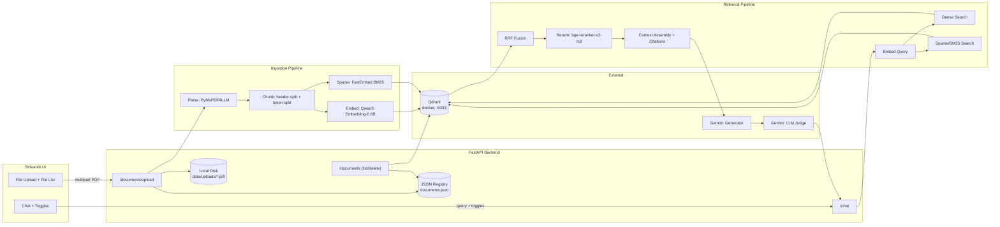
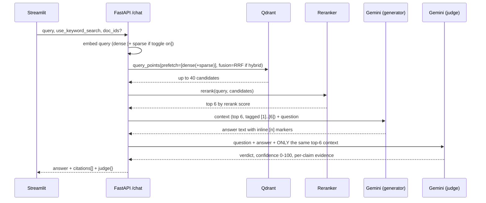

# RAG Application — Implementation Plan

FastAPI backend + Streamlit UI + Qdrant (Docker) + local free embedding/reranking + Gemini API generation, with hybrid (semantic + keyword) retrieval, reranking, citations, and an LLM-judge confidence score.

Grounded against verified 2026 specifics: Qdrant v1.19 hybrid Query API, current MTEB-leading Apache-2.0 embedding/reranker models, `google-genai` SDK (the `google-generativeai` package is EOL), and current FastAPI/Streamlit ingestion patterns.

---

## 1. Goals & Non-Negotiables (from the brief)

- FastAPI backend, Streamlit frontend.
- PDFs uploaded → stored on local disk + tracked in a **JSON registry** (filename, metadata, SHA-256 hash) so an unchanged re-upload is detected and **not** re-ingested.
- UI panel listing uploaded files (status, hash, chunk count).
- Chunking strategy with explicit, justified **size + overlap**.
- Free, strong, locally-run embedding model.
- Qdrant running via `docker run` locally, with **metadata filtering** on real payload fields.
- Retrieval must support a **toggle**: hybrid (semantic + keyword/BM25) vs. semantic-only — to visibly showcase the difference.
- A **reranking** stage always runs on whichever candidate set retrieval produced, before context reaches the LLM.
- Gemini API as the generation LLM.
- **Citations**: every answer must trace back to the exact source chunk(s) used.
- **LLM-as-judge**: a second pass validates the answer against the retrieved context and emits a confidence score.
- Overall bar: minimize hallucination / silent failure — correctness of the pipeline matters more than feature count.

---

## 2. Architecture



---

## 3. Tech Stack Decisions

| Layer | Choice | Why | Alternative considered |
|---|---|---|---|
| Backend | FastAPI + Uvicorn | async I/O for upload streaming + LLM calls | — |
| Frontend | Streamlit (`st.chat_message`, `st.chat_input`, `st.toggle`) | fastest path to a working chat+admin UI | Chainlit (less flexible sidebar/admin) |
| Vector DB | Qdrant (Docker, local) | native dense+sparse hybrid fusion (RRF/DBSF), rich payload filtering, single binary | pgvector (no built-in fusion), Weaviate |
| Embedding model | **Qwen/Qwen3-Embedding-0.6B** (Apache-2.0) | best quality-per-compute open model; 1024-dim; 32,768-token context (chunks never silently truncated); native `sentence-transformers` support with built-in prompt templates | `BAAI/bge-m3` (simpler — no prefix needed, 8192 ctx, but slightly lower English retrieval score) |
| Reranker | **BAAI/bge-reranker-v2-m3** (Apache-2.0, 568M) | strong BEIR/MIRACL accuracy, CPU-feasible, first-class `sentence-transformers` `CrossEncoder` support | `mixedbread-ai/mxbai-rerank-large-v2` (better ceiling, needs a GPU for good latency) |
| Keyword/sparse vector | `fastembed` `SparseTextEmbedding("Qdrant/bm25")` | computed **locally**, no network dependency, fuses natively with Qdrant's `FusionQuery` | Qdrant server-side inference (adds a moving part to the Qdrant container) |
| PDF parsing | `pymupdf4llm.to_markdown(..., page_chunks=True)` | preserves headings/tables as Markdown, returns per-page text + metadata (page numbers) for free | `unstructured` (`hi_res`) — higher setup cost, inconsistent quality on complex layouts per 2025-26 reports |
| Chunker | `langchain_text_splitters` `MarkdownHeaderTextSplitter` → `RecursiveCharacterTextSplitter.from_tiktoken_encoder(...)` | structure-aware first pass (keeps section headings as metadata), then token-accurate uniform sizing | Semantic (embedding-similarity) chunking — modest recall gain (~single digits) for a real extra embedding-call cost; kept as a Phase-6 option |
| Registry store | Flat JSON (`documents.json`), keyed by SHA-256 hash, `filelock` + atomic `temp-file → os.replace()` writes | matches the brief's explicit ask for a JSON tracking file; single-writer-safe | SQLite — documented upgrade path once ingestion runs as a separate worker process |
| Generator LLM | Gemini `gemini-3.6-flash` via `google-genai` SDK | current, free-tier eligible, structured JSON output support | `gemini-3.5-flash-lite` if you need a bigger free daily request budget |
| Judge LLM | Gemini `gemini-3.5-flash` (different tier than the generator) | reduces self-preference bias (same-family judges are documented to score their own family higher) | a second provider entirely, if available |
| Ingestion trigger | FastAPI `BackgroundTasks` (MVP) → upgrade path to `arq` + Redis | zero extra infra for a local demo; note the durability caveat explicitly | `arq` (asyncio-native queue) once you need retry/restart-safety |

---

## 4. Chunking Strategy (size, overlap, and why)

**Parsing.** `pymupdf4llm.to_markdown(pdf_path, page_chunks=True)` returns Markdown text per page, with tables rendered as Markdown tables and headings preserved — this must happen before any splitter runs; no splitter can recover from a garbled extraction.

**Step 1 — structure split.** Run `MarkdownHeaderTextSplitter` on each page's Markdown against header levels (`#`, `##`, `###`) to get section-bounded text blocks, tagging each with `section_heading` metadata. Sections that are **table blocks** (lines starting with `|`) are pulled out and kept as **one atomic chunk each**, regardless of size — tables are the single most common chunking failure mode (a generic splitter shreds rows into meaningless fragments).

**Step 2 — size-normalize.** Any remaining text section longer than the target is passed through:

```python
from langchain_text_splitters import RecursiveCharacterTextSplitter

splitter = RecursiveCharacterTextSplitter.from_tiktoken_encoder(
    encoding_name="cl100k_base",
    chunk_size=500,      # tokens
    chunk_overlap=75,    # tokens (~15%)
    separators=["\n\n", "\n", ". ", " ", ""],
)
```

- **Chunk size: 500 tokens (~2,000 characters).** Small enough to keep embedding vectors discriminative (diluted/averaged vectors are a documented failure mode of over-large chunks), large enough to hold a complete thought.
- **Overlap: 75 tokens (~15%).** A hedge against boundary loss, not a guaranteed win — at least one 2026 study found overlap gave no measurable benefit on its eval set. Ship with 15%, but validate against your own eval set (Section 12) and be willing to drop it to 0 if it doesn't move recall.
- Token-based (not character-based) sizing is deliberate: character-count defaults from older LangChain tutorials (4000 chars / 200 overlap) undercount relative to the embedding model's actual tokenizer.

**Metadata attached to every chunk** (needed for both citations and filtering):

| field | example | used for |
|---|---|---|
| `doc_id` | `f3a1...` (uuid) | scoping/filtering/delete |
| `filename` | `handbook.pdf` | citation display, filter |
| `file_hash` | sha256 hex | dedup traceability |
| `page_number` | `4` | citation display, filter |
| `section_heading` | `"3.2 Refund Policy"` | citation display |
| `chunk_index` | `12` | ordering, debug |
| `content_type` | `text` \| `table` | UI rendering hint |
| `upload_date` | ISO 8601 | filter (recency) |

**Phase-6 accuracy multipliers (documented, not required for MVP):**
- **Parent-document retrieval** — index these same 500-token chunks for *search*, but expand each hit to a larger (~2,000-token) parent section before it's sent to the LLM, solving the precision-vs-context tradeoff outright (`langchain.retrievers.ParentDocumentRetriever` or LlamaIndex `HierarchicalNodeParser` + `AutoMergingRetriever`).
- **Contextual Retrieval** (Anthropic) — prepend a short LLM-written blurb ("this chunk is from §3.2 of handbook.pdf, about refund eligibility windows") to each chunk before embedding. Anthropic's own benchmark: −49% retrieval failures alone, −67% combined with reranking.

---

## 5. Embedding & Reranking

```python
from sentence_transformers import SentenceTransformer, CrossEncoder

embedder = SentenceTransformer("Qwen/Qwen3-Embedding-0.6B")   # 1024-dim, Apache-2.0
passage_vecs = embedder.encode(chunk_texts)                     # no prefix needed
query_vec    = embedder.encode(user_query, prompt_name="query") # model applies its Instruct/Query template

reranker = CrossEncoder("BAAI/bge-reranker-v2-m3")
pairs = [[user_query, c.text] for c in candidates]
scores = reranker.predict(pairs)   # raw logits — sigmoid them for a [0,1] display score
```

- **Load both models once at process startup** (module-level singletons) — never per-request; both are CPU-feasible but not free.
- Reranker scores are a **within-query** relative ranking signal only — never compare them across different queries or use one as a fixed absolute cutoff.
- Rerank the **top 30–50** first-stage candidates down to the **top 5–8** that actually go to the LLM. Reranking far beyond ~100 candidates rarely helps and only adds latency.

---

## 6. Qdrant Setup (hybrid dense + sparse, local Docker)

**Run it:**

```powershell
docker run -d --name qdrant `
  -p 6333:6333 -p 6334:6334 `
  -v C:\qdrant_storage:/qdrant/storage `
  qdrant/qdrant
```
> Windows note: the bash `-v $(pwd)/qdrant_storage:...` shown in Qdrant's own docs does not expand in PowerShell — use an absolute Windows path (or `${PWD}`) as above. Always mount the volume; without it, `docker rm` destroys every indexed vector.

**Collection with two named vectors (dense + sparse):**

```python
from qdrant_client import QdrantClient, models

client = QdrantClient(url="http://localhost:6333")

client.create_collection(
    collection_name="rag_documents",
    vectors_config={
        "dense": models.VectorParams(size=1024, distance=models.Distance.COSINE),
    },
    sparse_vectors_config={
        "sparse": models.SparseVectorParams(modifier=models.Modifier.IDF),  # required for real BM25-style scoring
    },
)

for field, schema in [
    ("filename", models.PayloadSchemaType.KEYWORD),
    ("file_hash", models.PayloadSchemaType.KEYWORD),
    ("doc_id", models.PayloadSchemaType.KEYWORD),
    ("page_number", models.PayloadSchemaType.INTEGER),
    ("upload_date", models.PayloadSchemaType.DATETIME),
]:
    client.create_payload_index(collection_name="rag_documents", field_name=field, field_schema=schema)
```

**Upsert (dense + sparse together):**

```python
client.upsert(collection_name="rag_documents", points=[
    models.PointStruct(
        id=chunk_id,
        vector={
            "dense": dense_vec.tolist(),
            "sparse": models.SparseVector(indices=sparse.indices, values=sparse.values),
        },
        payload={"doc_id": doc_id, "filename": filename, "file_hash": file_hash,
                  "page_number": page, "section_heading": heading,
                  "chunk_index": idx, "content_type": ctype,
                  "upload_date": upload_date_iso, "text": chunk_text},
    )
])
```

**Query — hybrid (toggle ON) vs. semantic-only (toggle OFF):**

```python
prefetch = [models.Prefetch(query=dense_vec.tolist(), using="dense", limit=40)]
if use_keyword_search:
    prefetch.append(models.Prefetch(query=models.SparseVector(indices=sq.indices, values=sq.values),
                                     using="sparse", limit=40))

result = client.query_points(
    collection_name="rag_documents",
    prefetch=prefetch,
    query=models.FusionQuery(fusion=models.Fusion.RRF) if use_keyword_search else None,
    using="dense" if not use_keyword_search else None,
    query_filter=models.Filter(must=[models.FieldCondition(key="doc_id", match=models.MatchAny(any=doc_ids))]) if doc_ids else None,
    limit=40,
).points   # <-- results are on `.points`, not the return value itself
```

**Gotchas to build around:**
- Dense vectors live in `vectors_config`; sparse vectors have their *own* `sparse_vectors_config` — merging them into one dict is the #1 setup mistake.
- Sparse values must be `models.SparseVector(indices=..., values=...)`, never a plain list.
- `Modifier.IDF` must be set at collection-creation time or BM25-style IDF weighting never applies.
- The full-text **payload** index (`TextIndexParams` + `MatchText`) is a boolean filter, not a ranked score — it cannot be fused via RRF. The keyword *ranking* leg is the sparse **vector**, not the payload text index.

---

## 7. Retrieval + Reranking + Generation Flow



**Generation call** (Gemini, structured output):

```python
from google import genai
from google.genai import types
from pydantic import BaseModel

class Answer(BaseModel):
    answer: str
    used_source_indices: list[int]   # which of the numbered context blocks were actually used

client = genai.Client()  # reads GEMINI_API_KEY
resp = client.models.generate_content(
    model="gemini-3.6-flash",
    contents=build_prompt(question, numbered_context),
    config=types.GenerateContentConfig(response_mime_type="application/json", response_schema=Answer),
)
result: Answer = resp.parsed
```

Prompt instructs the model explicitly: *answer only from the numbered context; cite every claim with `[n]`; if the context doesn't contain the answer, say so — never use outside knowledge.*

**Citations** are then built server-side from `used_source_indices`, mapping back to the reranked chunk list — **never** from the full retrieval candidate list, so a citation always reflects a chunk the model actually saw:

```python
citations = [
    {"marker": i+1, "doc_id": c.doc_id, "filename": c.filename, "page_number": c.page_number,
     "chunk_id": c.chunk_id, "snippet": c.text[:280], "rerank_score": c.score}
    for i, c in enumerate(reranked_top_k) if (i + 1) in result.used_source_indices
]
```

**LLM-as-judge** (separate call, RAGAS-style claim decomposition, grounded strictly in the same context the generator used — not general world knowledge):

```python
class ClaimVerdict(BaseModel):
    claim: str
    supported: bool
    evidence_quote: str   # must be a literal substring of the provided context

class Judgment(BaseModel):
    verdict: str            # "grounded" | "partially_grounded" | "hallucinated"
    confidence: int         # 0-100
    claims: list[ClaimVerdict]
    notes: str

judge_resp = client.models.generate_content(
    model="gemini-3.5-flash",
    contents=build_judge_prompt(question, answer, numbered_context),  # SAME context, explicit "don't use outside knowledge"
    config=types.GenerateContentConfig(response_mime_type="application/json", response_schema=Judgment),
)
judgment: Judgment = judge_resp.parsed

# don't trust the verdict blindly — verify each "supported" evidence_quote actually occurs in the context text
for c in judgment.claims:
    if c.supported and c.evidence_quote not in numbered_context:
        c.supported = False   # judge hallucinated its own evidence — downgrade
confidence = round(100 * sum(c.supported for c in judgment.claims) / max(len(judgment.claims), 1))
```

Using a different model tier as judge (`gemini-3.5-flash`) than generator (`gemini-3.6-flash`) mitigates the documented self-preference bias of same-family judges. Sample judge calls in production if free-tier quota is tight (judge 100% in offline eval, e.g. 10–20% of live traffic).

---

## 8. Local Storage + JSON Registry (upload, hash, dedup)

**On upload** (`POST /documents/upload`):

1. Stream the file to a temp path while computing SHA-256 incrementally (`hashlib.sha256().update(chunk)` per chunk read — no second pass needed):
   ```python
   digest = hashlib.sha256()
   async with aiofiles.open(tmp_path, "wb") as out:
       while chunk := await file.read(1 << 20):
           digest.update(chunk)
           await out.write(chunk)
   file_hash = digest.hexdigest()
   ```
2. Look up `file_hash` in the registry. **Match found** → discard the temp file, return `{"status": "duplicate", "doc_id": <existing>, "message": "identical content already indexed as <original_filename>"}`. **No match** → move the temp file to `data/uploads/{doc_id}.pdf`, write a `pending` registry entry, kick off ingestion, return `{"doc_id", "status": "processing"}`.

**Registry schema** (`data/registry/documents.json`, dict keyed by hash so dedup lookup is O(1)):

```json
{
  "e3b0c4...": {
    "doc_id": "6f2a...",
    "original_filename": "employee_handbook.pdf",
    "stored_path": "data/uploads/6f2a....pdf",
    "file_hash": "e3b0c4...",
    "file_size_bytes": 482913,
    "upload_timestamp": "2026-08-21T10:15:00Z",
    "status": "indexed",
    "num_pages": 34,
    "num_chunks": 96,
    "error": null
  }
}
```

**Atomic, lock-safe writes** (guards the classic lost-update race between two concurrent uploads):

```python
from filelock import FileLock
import json, os, tempfile

def save_registry(path, data):
    with FileLock(str(path) + ".lock"):
        fd, tmp = tempfile.mkstemp(dir=os.path.dirname(path))
        with os.fdopen(fd, "w") as f:
            json.dump(data, f, indent=2)
            f.flush()
            os.fsync(f.fileno())
        os.replace(tmp, path)   # atomic on both POSIX and Windows
```

Every read-modify-write of the registry (upload, status update on ingest completion, delete) takes the same lock. This is a deliberate JSON-file design per the brief; if a second writer process (e.g., a separate ingestion worker) is introduced later, migrate to SQLite with a `UNIQUE` index on `file_hash` — noted in Section 12.

---

## 9. FastAPI Surface

| Method | Path | Purpose |
|---|---|---|
| `POST` | `/documents/upload` | stream+hash a PDF, dedup-check, persist, enqueue ingestion |
| `GET` | `/documents` | list all registry entries (for the UI file panel) |
| `GET` | `/documents/{doc_id}` | single doc detail/status (polling target while `processing`) |
| `DELETE` | `/documents/{doc_id}` | remove disk file + registry entry + Qdrant points (`filter=FieldCondition(doc_id)`) |
| `POST` | `/chat` | `{query, use_keyword_search: bool, top_k?: int, doc_ids?: [str]}` → `{answer, citations[], judge{}, retrieval_debug{}}` |
| `GET` | `/health` | liveness + Qdrant connectivity check |

`retrieval_debug` (`{mode: "hybrid"|"semantic", candidates_after_fusion: int, reranked_returned: int}`) is what powers the "showcase the difference" requirement — the UI can display it next to the toggle state.

---

## 10. Streamlit UI

**Sidebar**
- `st.file_uploader(..., type=["pdf"], accept_multiple_files=True)` + Upload button → calls `/documents/upload` per file, shows per-file status.
- Document table (`st.dataframe` from `GET /documents`): filename, status pill, pages, chunks, hash (truncated), upload date, delete button per row.
- **Retrieval Settings** expander:
  - `st.toggle("Enable keyword search (hybrid)")` — session-state-backed, sent as `use_keyword_search` on every `/chat` call. This is the toggle the brief asks for, to demonstrate semantic-only vs. hybrid behavior side by side.
  - `st.multiselect` to optionally scope chat to specific uploaded document(s) — exercises the metadata filter (`doc_ids` → Qdrant `Filter`).
  - `top_k` slider.

**Main pane**
- `st.chat_message` history loop over `st.session_state.messages`; `st.chat_input` for new turns.
- Each assistant turn renders: the answer text (inline `[n]` markers), a **Sources** `st.expander` listing `filename.pdf, p.4 — "…snippet…" (rerank score 0.91)` per citation, and a confidence badge — `🟢 Grounded — 92%` / `🟡 Partially grounded — 61%` / `🔴 Hallucinated — 18%` — with its own expander showing the judge's per-claim breakdown.
- A small debug caption under each answer: `mode: hybrid · candidates: 40 → reranked: 6` so the toggle's effect is visibly obvious during a demo.

A critical implementation detail carried over from the toggle: **read it from `st.session_state` at call time and thread it explicitly into the `/chat` payload** — a common Streamlit bug is reading a widget's render-time value instead of its current session-state value, which silently sends the wrong toggle state.

---

## 11. Project Structure

```
rag-app/
  backend/
    app/
      main.py                      # FastAPI app, router mounting, startup model loading
      core/config.py               # pydantic-settings: GEMINI_API_KEY, QDRANT_URL, model names, chunk size/overlap
      api/documents.py             # upload / list / delete endpoints
      api/chat.py                  # /chat endpoint
      ingestion/parser.py          # pymupdf4llm wrapper
      ingestion/chunker.py         # header split + token split + table isolation
      ingestion/embedder.py        # Qwen3-Embedding singleton
      ingestion/sparse.py          # fastembed BM25 singleton
      retrieval/qdrant_store.py    # collection mgmt, upsert, hybrid query_points
      retrieval/reranker.py        # CrossEncoder singleton
      llm/gemini_client.py         # generate() + judge() calls, Pydantic schemas
      llm/prompts.py
      registry/json_store.py       # atomic read/write, hash lookup, filelock
      services/ingestion_service.py  # orchestrates upload -> parse -> chunk -> embed -> qdrant -> registry
      services/chat_service.py       # orchestrates retrieve -> rerank -> generate -> judge -> citations
      models/schemas.py            # Pydantic request/response models
    data/uploads/                  # raw PDFs, named <doc_id>.pdf
    data/registry/documents.json
    requirements.txt
  frontend/
    streamlit_app.py
    utils/api_client.py            # httpx.Client wrapper
    requirements.txt
  docker-compose.yml               # qdrant service (+ backend/frontend once containerized)
  .env.example                     # GEMINI_API_KEY, QDRANT_URL, EMBED_MODEL, RERANK_MODEL, CHUNK_SIZE, CHUNK_OVERLAP
```

---

## 12. Local Dev Setup

```powershell
# 1. Qdrant
docker run -d --name qdrant -p 6333:6333 -p 6334:6334 -v C:\qdrant_storage:/qdrant/storage qdrant/qdrant

# 2. Backend
cd backend
python -m venv .venv; .venv\Scripts\activate
pip install fastapi uvicorn[standard] qdrant-client sentence-transformers fastembed `
            pymupdf4llm langchain-text-splitters google-genai pydantic-settings `
            aiofiles filelock httpx python-multipart
$env:GEMINI_API_KEY = "..."
uvicorn app.main:app --reload --port 8000

# 3. Frontend (separate terminal / venv)
cd frontend
pip install streamlit httpx
streamlit run streamlit_app.py
```

Open `http://localhost:8501` → upload a PDF → wait for status `indexed` → chat, toggling keyword search on/off to compare `retrieval_debug`.

**Validation before calling it "accurate":** hand-write 10–15 question/expected-source-page pairs against your own test PDFs. Run each through both toggle states and confirm (a) the cited pages match expectation, (b) the judge's confidence tracks actual groundedness (spot-check a few manually), (c) hybrid mode measurably helps on queries with exact terms/codes/names that pure semantic search tends to miss (e.g. part numbers, acronyms) — that contrast is the whole point of building the toggle.

---

## 13. Phased Build Roadmap

| Phase | Deliverable |
|---|---|
| 0 | Scaffold repo, Qdrant up via Docker, `/health` confirms connectivity |
| 1 | Ingestion pipeline (parse → chunk → embed → upsert) + JSON registry + hash-dedup + Streamlit upload/list panel — no chat yet |
| 2 | Semantic-only retrieval → reranker → Gemini generation → citations (chat works end-to-end, dense-only) |
| 3 | Add sparse/BM25 vector + `FusionQuery(RRF)` + UI toggle — **this is the milestone that lets you demo semantic-only vs. hybrid side by side** |
| 4 | LLM-as-judge + confidence score + UI badge |
| 5 | Metadata filters in UI (scope to doc(s)/date), 10–15 item eval set, tune chunk size/overlap against it |
| 6 (optional) | Parent-document chunking, Contextual Retrieval blurbs, JSON→SQLite registry migration, `BackgroundTasks`→`arq`+Redis for durable ingestion, second judge model for ensemble scoring, PDF viewer with citation highlight |

---

## 14. Consolidated Risk Register

| Risk | Mitigation |
|---|---|
| Embedding query/passage prefix mismatch silently degrades retrieval | Use `sentence-transformers`' `prompt_name="query"` (model-shipped template) instead of hand-built prefix strings |
| Qdrant dense/sparse config mixed into one dict | Dense → `vectors_config`; sparse → its own `sparse_vectors_config` — always separate |
| `query_points()` treated as a list | Results are on `.points` |
| FastAPI `BackgroundTasks` handed a raw `UploadFile` | Persist to disk first, pass the path/`doc_id` into the task (file is closed by task-run time since FastAPI 0.106) |
| Concurrent uploads racing on `documents.json` | `filelock` around every read-modify-write + atomic temp-file → `os.replace()` |
| Citations pointing at chunks the model never saw | Build `citations[]` only from `used_source_indices` mapped against the exact reranked context sent to the generator |
| Judge hallucinating its own "supported" verdict | Require a literal quoted span per claim; programmatically verify the quote occurs in the context before trusting it |
| Targeting `gemini-2.0-flash` | Retired March 3, 2026 — use `gemini-3.6-flash` or newer |
| Assuming a fixed Gemini free-tier RPM/RPD number | Google stopped publishing one in 2026 — implement 429 retry/backoff regardless, check `aistudio.google.com/rate-limit` for live numbers |
| Assuming any `-pro` model is usable on a free-tier key | Confirmed live: this account's free tier grants **0 request quota to every `-pro` model** (429 `RESOURCE_EXHAUSTED`, `limit: 0`) — pick two distinct flash-tier models for generator/judge instead of flash+pro |
| Assuming a model name from a blog post or older code is still live | Confirmed live: `gemini-2.5-flash` and `gemini-2.5-pro` both 404 ("no longer available to new users") despite still appearing in `models.list()`, and `gemini-1.5-flash` isn't in the catalog at all anymore — call `GET https://generativelanguage.googleapis.com/v1beta/models?key=...` and/or just try the call before trusting a hardcoded name |
| Sensitive PDFs on the Gemini free tier | Free tier defaults to allowing Google to train on submitted content — flag this explicitly if the demo corpus is not public |
| A generic splitter cutting through a table | Detect table blocks in the parsed Markdown and keep each as one atomic chunk |
| Windows `docker run -v $(pwd)/...` | Doesn't expand in PowerShell — use an absolute path or `${PWD}` |
